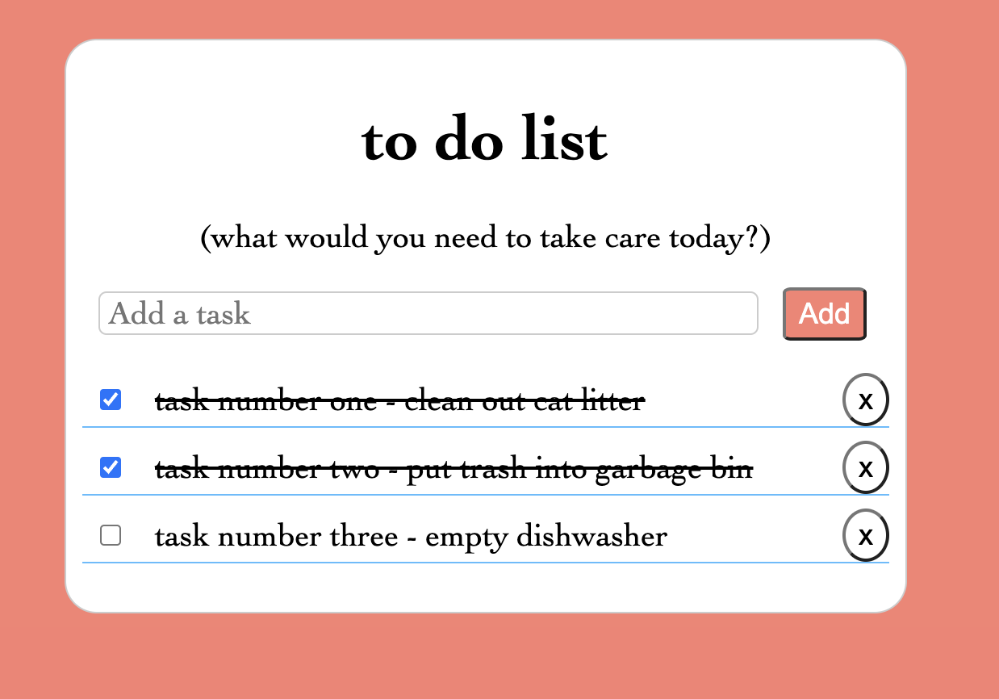

# to do list

# A simple to-do list application implemented with JavaScript, HTML, and CSS.



# STEPS
#
# 1. Enter new task in the input field and click 'Add' button
# 2. See new task item showing below input field
# 3. New task item have a checkbox for strike through task item
#    if completed task and X button to remove a task item.
# 4. Add new task if needed
# 5. Strike through task when completed task
# 6. Remove task item to click on "X" button


## Features

- Add new to-do items
- Mark tasks as completed with a checkbox
- Strike through effect for completed tasks
- Remove to-do item clicking on 'X' button
- Data persistence using `localStorage`

## Usage

User workflow
A user should be able to ADD a brand new TO-DO
A user should be able to see a list of current TO-DO’s
When a user mark’s a TO-DO as completed the message of the TO-DO should be crossed out (using strike through font)
A user should have the option of deleting TO-DO’s that have been mark completed
BONUS (if completed ahead of time):  TO-DO list should use for each user between visits (using local storage)


1. Clone the repository:

   ```bash
   git clone <repository-url>


Open the index.html file in your web browser.

Add a new task by entering the task description in the input field and clicking the "Add Task" button.

To mark a task as completed, click the checkbox next to the task. The task text will be strike through.

To remove a task, click the "X" button next to the task.

The tasks are automatically saved in the localStorage, so you can close the browser and reopen the application to see your tasks persist.